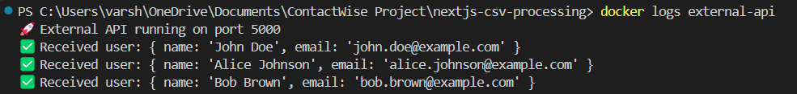

# CSV File Upload and Background Processing in Next.js

## Overview
This project enables users to upload CSV files containing user data. The uploaded files are processed in the background using a job queue, and the extracted data is sent to an external API for further handling. The entire system is containerized using Docker, making it easy to deploy and manage.

## Features
- File upload functionality using Next.js API routes
- CSV parsing and data validation
- Background job processing with Redis and Bull
- External API integration to handle user data
- Docker-based setup for seamless deployment

## Project Structure
```
nextjs-csv-processing/
│── api/
│   ├── Dockerfile
│   ├── package.json
│   ├── package-lock.json
│   └── server.js
│
│── app/
│   ├── favicon.ico
│   ├── globals.css
│   ├── layout.tsx
│   └── page.tsx
│
│── jobs/
│   ├── queue.js
│   └── worker.js
│
│── pages/api/
│   └── upload.js
│
│── uploads/
│   └── sample.csv
│
│── .dockerignore
│── .gitignore
│── docker-compose.yml
│── Dockerfile
│── next.config.ts
│── next-env.d.ts
│── package.json
│── package-lock.json
│── README.md
│── tailwind.config.ts
│── postcss.config.mjs
│── eslint.config.mjs
```

## Dependencies
- **Next.js** (Frontend and API routes)
- **Express.js** (For external API handling)
- **Multer** (File upload handling)
- **csv-parser** (CSV parsing)
- **Bull** (Queue management using Redis)
- **Redis** (Used as a job queue backend)
- **Axios** (For API requests)

## Setting Up Redis with Docker
Redis is required for managing job queues. To run Redis using Docker, use the following command:

```bash
docker run --name redis-server -d -p 6379:6379 redis
```

Alternatively, since Redis is already included in the `docker-compose.yml`, you can start all services, including Redis, by running:

```bash
docker-compose up --build
```

## Setup Instructions
1. Clone the repository:
   ```bash
   git clone https://github.com/your-repo/nextjs-csv-processing.git
   cd nextjs-csv-processing
   ```
2. Install dependencies:
   ```bash
   npm install
   ```
3. Start the project using Docker:
   ```bash
   docker-compose up --build
   ```
4. Upload a CSV file via the frontend and monitor the logs to see job processing in action.

## Screenshots




## Demo Video
[Video Link](https://drive.google.com/file/d/1TJk3f3PCsHpgDcW_147nWwN1cJNRZzbd/view?usp=sharing)

## Conclusion
This project demonstrates how to handle file uploads, process CSV data asynchronously, and interact with external APIs using a background job system in a Dockerized Next.js environment.

